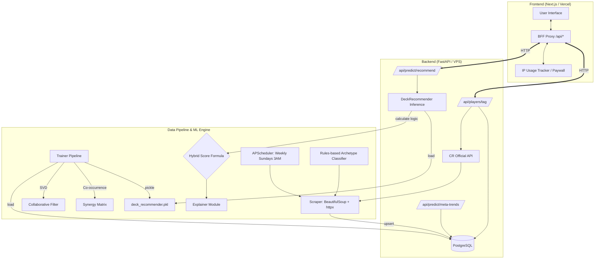

# Clash Royale ML Deck Recommender — Project Scope & Requirements

This document outlines the complete scope, technical requirements, and architecture for the Clash Royale ML Deck Recommender application. It is intended to serve as a comprehensive reference guide for further development and maintenance.

## 1. Project Overview
A full-stack web application that uses machine learning to provide highly personalized Clash Royale deck recommendations. By accepting a user's Supercell player tag, the system fetches their current profile (card levels, arena, trophies), runs the data through a custom hybrid ML model, and returns 3 optimized decks along with detailed AI-generated explanations of why those decks were chosen.

## 2. Core Features & Capabilities
- **Player Profile Integration:** Fetches real-time player data (cards, levels, trophies, arena) via the official Clash Royale API.
- **Hybrid Machine Learning Engine:** Blends 4 distinct scoring methods:
  - **Collaborative Filtering (SVD):** Projects a user's collection into a latent space to find what successful players with similar collections are using.
  - **Content-Based Filtering (Synergy):** Analyzes historical match data to identify card pairs with high co-occurrence in winning decks.
  - **Level Fitness:** Heavily penalizes decks containing underleveled cards that would be unviable on the ladder for that specific player.
  - **Meta Win Rate:** Weights decks based on their actual performance in the top ladder.
- **Archetype Filtering:** Allows users to filter recommendations by playstyle (Cycle, Beatdown, Bridge Spam, Control, Bait).
- **Explainable AI:** Generates detailed, human-readable explanations covering deck strategy, key synergies, level advantages, and meta stability.
- **Automated Data Pipeline:** A weekly CRON job scrapes top ladder battle logs, computes synergy matrices, updates meta decks, and retrains the model.
- **Usage Tracking & Monetization:** Implements an IP-based tracking system offering 3 free recommendations before gating access behind a Stripe checkout (one-time payment for lifetime access).

## 3. Technology Stack

### Frontend (Next.js 16)
- **Framework:** Next.js with React 19 (App Router)
- **Styling:** Tailwind CSS v4 using modern `@theme` variables for a cohesive red-to-blue gradient aesthetic with glassmorphism UI elements.
- **Icons:** Lucide React
- **Architecture:** Backend-For-Frontend (BFF) Proxy pattern. The browser only communicates with Next.js API routes (`/api/recommend`, `/api/player`), which handle rate limiting and proxy the requests to the private Python backend.

### Backend (FastAPI)
- **Framework:** FastAPI (Python 3.12)
- **Database:** PostgreSQL 16
- **ORM:** SQLAlchemy 2.0 with `asyncpg` for fully asynchronous database operations.
- **Machine Learning:** `scikit-learn` (TruncatedSVD), `numpy`, `pandas`.
- **Scraping & Networking:** `httpx`, `BeautifulSoup4`.
- **Task Scheduling:** `APScheduler` (running inside the FastAPI lifespan context).

## 4. System Architecture

## 5. Directory Structure Reference

### Server (`/server`)
- `main.py`: FastAPI application entry point, mounts routers and lifespan.
- `requirements.txt`: Python dependency list.
- `Dockerfile`: Container definition for the API.
- `app/`
  - `database.py` & `models.py`: Async SQLAlchemy setup and 5 table schemas (Cards, MetaDecks, Players, CardSynergies, UsageTracking).
  - `services/cr_api.py`: Client for interacting with the official Clash Royale API.
  - `data/`
    - `scraper.py`: Logic for importing deck data and processing battle logs.
    - `scheduler.py`: Weekly CRON wrapper for scraping and retraining.
    - `archetype_classifier.py`: Rule mechanisms mapping cards to deck archetypes.
  - `ml/`
    - `model.py`: The `DeckRecommender` class holding the hybrid scoring logic.
    - `trainer.py`: Script to query DB, train SVD, build synergy matrices, and save artifacts.
    - `explainer.py`: Generates the detailed textual explanation for recommendations.
  - `routers/`: FastAPI route definitions (`predict.py`, `players.py`, `decks.py`).

### Client (`/client`)
- `next.config.ts` & `package.json`: Next.js configuration.
- `src/`
  - `app/globals.css`: Tailwind v4 theme definitions and custom CSS animations.
  - `app/page.tsx`: Premium landing page.
  - `app/recommend/page.tsx`: Form for capturing Tag and Archetype.
  - `app/results/page.tsx`: Handles dynamic loading, parses results, and displays the 3 DeckCards.
  - `app/payment/page.tsx`: Stripe paywall placeholder.
  - `app/api/`: Next.js Route Handlers proxying to FastAPI.
  - `components/`: Reusable UI (`Navbar.tsx`, `DeckCard.tsx`, `PlayerCard.tsx`).

## 6. Implementation Status
- [x] **Phase 0:** Planning & Architecture Design
- [x] **Phase 1:** Data Pipeline (Scraping, Auto-Classification, Scheduling)
- [x] **Phase 2:** Machine Learning Engine (SVD, Synergies, Level Fitness, Explainer)
- [x] **Phase 3:** FastAPI Backend & API Layer
- [x] **Phase 4:** Next.js Frontend (Theme, Pages, Proxies, Tracking)
- [ ] **Phase 5:** Deployment (Hetzner VPS for Backend, Vercel for Frontend) and Real-World Model Training.

## 7. Next Steps & Known Limitations
1. **Model Initialization:** Obtain a Clash Royale API Key, configure `.env`, spin up the PostgreSQL database (`docker-compose up -d db`), and run `python -m app.ml.trainer` to perform the initial data scrape and model training.
2. **Stripe Integration:** The `/payment` page currently acts as a visual placeholder. Formal Stripe checkout sessions and webhooks need to be integrated into `src/app/api/checkout`.
3. **Usage Tracking Limitations:** Currently, the free-tier limit is tracked via IP Addresses in-memory within the Next.js API route. This resets on server restart and does not perfectly map 1:1 with specific devices (e.g. users on the same Wi-Fi share an IP). Consider implementing Browser Fingerprinting or a Database-backed token for robust tracking.
